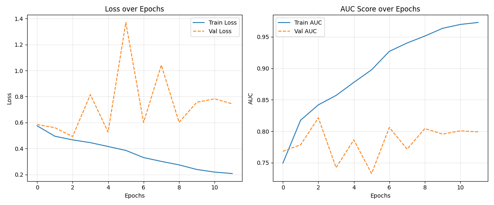

# Gravitational Wave Detection with Deep Learning


**"Listening to the Universe"**: A Computer Vision approach to detect binary black hole mergers in noisy LIGO time-series data.

## Project Overview
Gravitational waves are ripples in space-time caused by cataclysmic cosmic events. The signals captured by detectors (LIGO/Virgo) are known as "chirps", but they are often buried deep within environmental noise (low Signal-to-Noise Ratio).

This project treats the signal detection problem as an **Image Classification task**. We transform 1D time-series data into 2D time-frequency representations (Spectrograms) and train a Convolutional Neural Network (CNN) to distinguish between signal and noise.

---

## Methodology & Architecture

### 1. Signal Preprocessing (Physics-Informed)
Instead of using the standard Fourier Transform (STFT), we utilize the **Constant Q-Transform (CQT)** via the `nnAudio` library.
* **Why CQT?** Gravitational wave chirps sweep rapidly across frequencies. CQT uses a logarithmic frequency scale (similar to musical octaves), providing high resolution for low frequencies and high temporal resolution for high frequencies.

### 2. The "RGB" Strategy
The dataset provides data from 3 interferometers: **LIGO Hanford**, **LIGO Livingston**, and **Virgo**.
* Instead of averaging them, we treat them as the **Red, Green, and Blue channels** of an image.
* This allows the CNN to learn spatial correlations and time delays between detectors.

### 3. Model Architecture
* **Backbone:** `EfficientNet-B0` (Pretrained on ImageNet).
* **Optimization:** AdamW Optimizer with Learning Rate Scheduler (`ReduceLROnPlateau`).
* **Regularization:** Channel-wise Min-Max Normalization to handle signal dynamic range.

---

## Results

Current performance on the validation set (20k sample subset):
* **Train AUC:** ~0.90
* **Validation AUC:** **~0.81**

*(Plots generated automatically after training)*


---

## Setup & Installation

This project uses **uv** for fast dependency management.

### 1. Clone the Repository
```bash
git clone [https://github.com/solazzo1911897-collab/final-project-FDS.git](https://github.com/solazzo1911897-collab/final-project-FDS.git)
cd final-project-FDS
````

### 2. Install Dependencies

Ensure you have `uv` installed.

```
uv sync
source .venv/bin/activate  # On Mac/Linux
# .venv\Scripts\activate   # On Windows
```

### 3. Download the Data

⚠️ **Important:** Do not download the full dataset from Kaggle (77GB). Use the pre-processed subset provided by the team lead (`g2net_medium.zip`).

1. Get the `g2net_medium.zip` and `subset_labels.csv` files.
    
2. Place them inside the `data/raw/` folder.
    
3. Unzip the archive so you have a folder named `g2net_medium` containing the `.npy` files.
    
4. Extract the files so your structure looks **exactly** like this:
    

```
final-project-FDS/
├── data/
│   └── raw/
│       ├── subset_labels.csv
│       └── g2net_medium/        <-- Extracted folder containing .npy files
```

---

## Usage

### Train the Model

To start the training pipeline (Data Loading -> CQT -> EfficientNet Training):

```
python main.py
```

_The script automatically detects if you have a GPU (CUDA or MPS for Mac)._

### Generate Analysis Plots

To evaluate the trained model and generate the Confusion Matrix, ROC Curve, and the "Galaxy Gallery" of detected signals:

```
python generate_plots.py
```

---

## Project Structure

```
├── data/               # Raw data (ignored by git)
├── models/             # Saved model weights (.pth)
├── notebooks/          # Exploratory notebooks
├── src/                # Source code
│   ├── dataset.py      # Data loading & Preprocessing logic
│   ├── model.py        # EfficientNet Architecture definition
│   ├── train.py        # Training loop engine
│   └── transforms.py   # CQT Implementation details
├── main.py             # Entry point for training
├── generate_plots.py   # Entry point for evaluation
└── pyproject.toml      # Dependencies
```

---

## References

1. **Dataset:** European Gravitational Observatory (EGO). "G2Net Gravitational Wave Detection." Kaggle.
    
2. **Method:** Brown, J. C. (1991). "Calculation of a constant Q spectral transform." _J. Acoust. Soc. Am._
    
3. **Library:** Cheuk, K. W., et al. (2020). "nnAudio: An on-the-fly GPU Audio to Spectrogram Conversion Toolbox."
    
4. **Model:** Tan, M., & Le, Q. (2019). "EfficientNet: Rethinking Model Scaling for Convolutional Neural Networks."